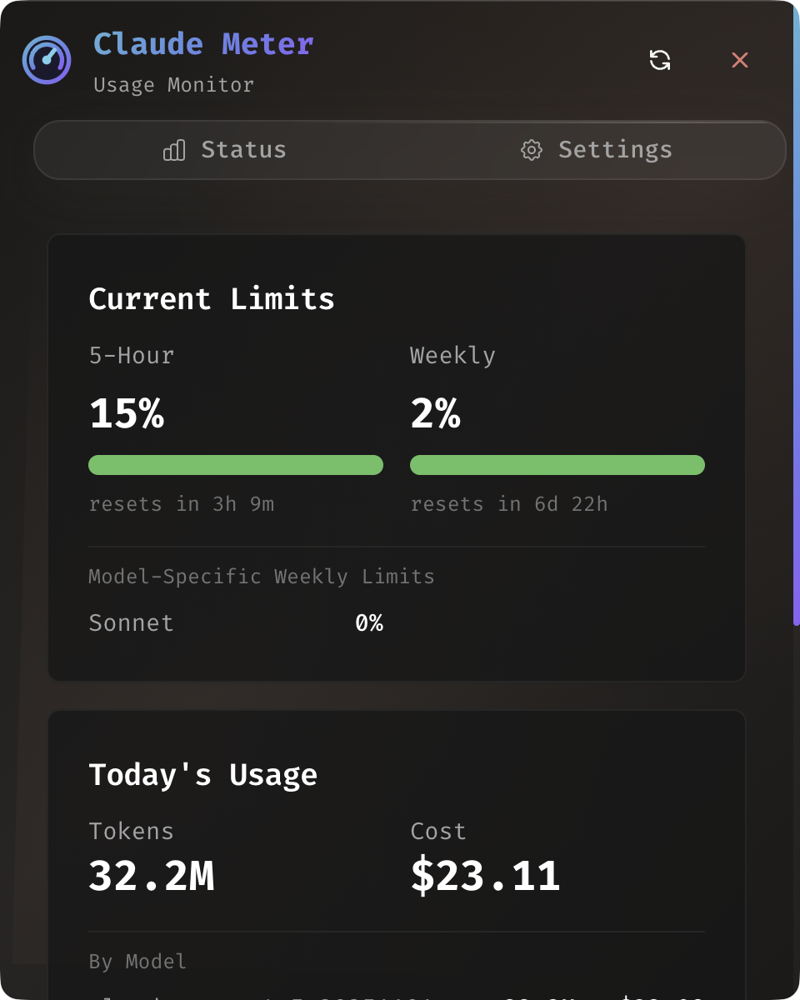
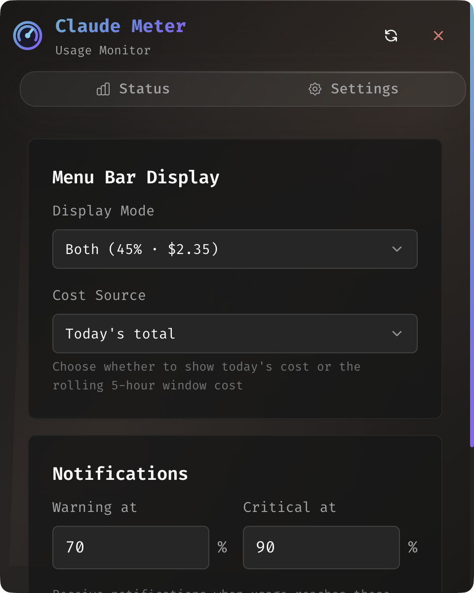

# Claude Meter

A clean macOS menu bar app for monitoring Claude Code usage in real-time.

Based on [CCSeva](https://github.com/Iamshankhadeep/ccseva), rewritten to focus on **data honesty** - showing only real API data without predictions or estimates.

## Screenshots

| Status View | Settings |
|-------------|----------|
|  |  |

## Features

- **Real-time usage** from Claude OAuth API (5-hour and weekly limits)
- **Token tracking** from local Claude Code usage files
- **Cost estimation** using current LiteLLM pricing
- **Menu bar display**: `45% · $2.35`
- **Model-specific limits** (Sonnet, Opus)
- **macOS notifications** at configurable thresholds

## What's Shown

| Data | Source | Accuracy |
|------|--------|----------|
| 5-Hour utilization % | Claude OAuth API | Exact |
| Weekly utilization % | Claude OAuth API | Exact |
| Reset times | Claude OAuth API | Exact |
| Token counts | Local ~/.claude files | Exact |
| Cost ($) | Tokens × LiteLLM pricing | Estimated |

## Installation

### Download

Download the latest release from [Releases](../../releases):

- **macOS (Apple Silicon)**: `Claude-Meter-2.0-arm64.dmg`
- **macOS (Intel)**: `Claude-Meter-2.0.dmg`

### Build from Source

```bash
git clone https://github.com/sioakim/claude-meter.git
cd claude-meter
npm install
npm run build
npm start
```

## Requirements

- macOS 10.15+
- [Claude Code](https://claude.ai/code) installed and authenticated
- Active Claude subscription (Pro, Max5, or Max20)

## Usage

1. **Launch** - Claude Meter appears in your menu bar showing `XX% · $X.XX`
2. **Click** - Opens the status window with detailed usage
3. **Right-click** - Quick menu with refresh and quit options

### Menu Bar Display Options

Configure in Settings:
- **Both**: `45% · $2.35` (default)
- **Percentage only**: `45%`
- **Cost only**: `$2.35`

## Development

```bash
npm run electron-dev   # Development with hot reload
npm run build          # Production build
npm run dist:mac       # Package DMG for distribution
npm run check          # Lint and format
```

## Architecture

```
Claude OAuth API ─────┐
  (utilization %)     │
                      ├──► Claude Meter ──► Menu Bar + UI
~/.claude/*.jsonl ────┤
  (token counts)      │
                      │
LiteLLM pricing ──────┘
  (cost calculation)
```

## Configuration

Settings stored in `~/.claude-meter/settings.json`:

```json
{
  "menuBarDisplayMode": "both",
  "menuBarCostSource": "today",
  "notificationThresholds": {
    "warning": 70,
    "critical": 90
  }
}
```

## Credits

Based on [CCSeva](https://github.com/Iamshankhadeep/ccseva) by Shankhadeep.

## License

MIT License - see [LICENSE](LICENSE) for details.
