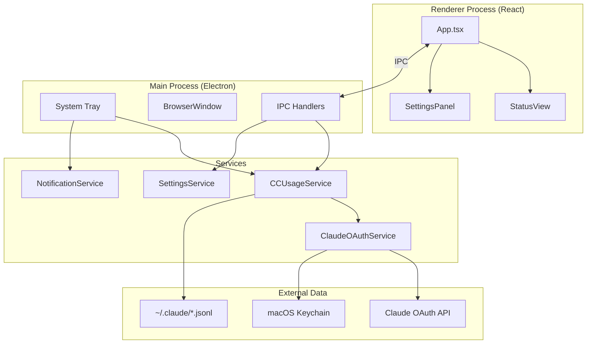
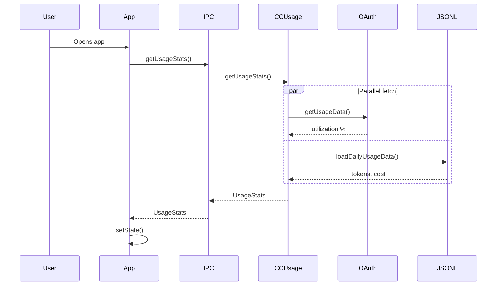
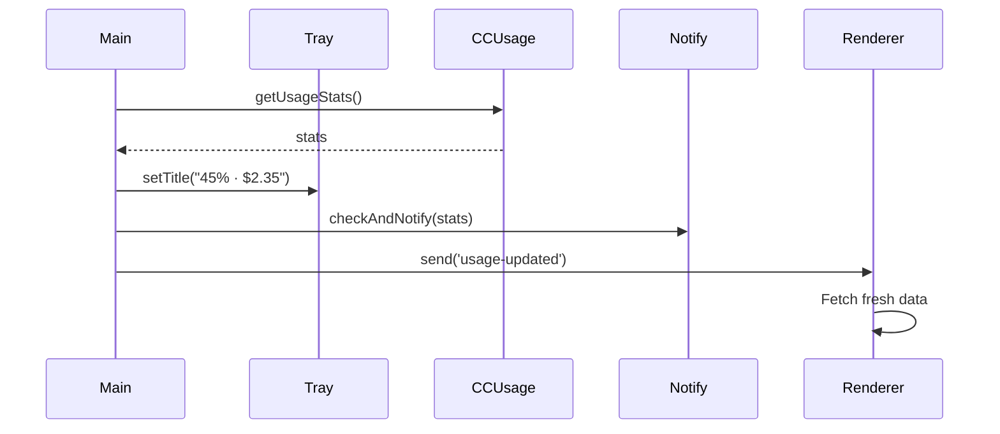

# Codebase Map

> Auto-generated by Cartographer. Last mapped: 2026-01-16

## System Overview



## Directory Structure

```
claude-meter/
├── main.ts                    # Electron main process - tray, window, IPC
├── preload.ts                 # Secure IPC bridge (contextBridge)
├── src/
│   ├── index.tsx             # React entry point
│   ├── App.tsx               # Main container - state, routing, shortcuts
│   ├── components/
│   │   ├── StatusView.tsx    # Usage display with progress bars
│   │   ├── SettingsPanel.tsx # User preferences UI
│   │   ├── NavigationTabs.tsx # Status/Settings tab switcher
│   │   ├── LoadingScreen.tsx # Initial loading animation
│   │   ├── ErrorBoundary.tsx # Error recovery wrapper
│   │   └── ui/               # Radix UI component wrappers
│   ├── services/
│   │   ├── ccusageService.ts # Main data aggregation
│   │   ├── claudeOAuthService.ts # OAuth API client
│   │   ├── settingsService.ts # Preferences persistence
│   │   └── notificationService.ts # macOS notifications
│   ├── types/
│   │   ├── usage.ts          # Data interfaces
│   │   └── electron.d.ts     # IPC type definitions
│   ├── lib/utils.ts          # cn() utility for Tailwind
│   └── styles/index.css      # Global CSS + Tailwind
├── package.json              # Dependencies, scripts
├── electron-builder.json     # DMG packaging config
├── webpack.config.js         # Renderer bundler
├── tailwind.config.js        # CSS customization
└── tsconfig*.json            # TypeScript configs (3 total)
```

## Module Guide

### Main Process

| File | Purpose | Tokens |
|------|---------|--------|
| `main.ts` | Electron entry - tray, window, IPC handlers, polling | 1,801 |
| `preload.ts` | Secure IPC bridge via contextBridge | 177 |

**Key Responsibilities:**
- System tray icon with usage percentage/cost
- Frameless 480x600 window (auto-hide on blur)
- 30-second polling interval
- IPC handlers: `get-usage-stats`, `refresh-data`, `load-settings`, `save-settings`

### Services

| File | Purpose | Tokens |
|------|---------|--------|
| `ccusageService.ts` | Aggregates OAuth + ccusage data | 1,821 |
| `claudeOAuthService.ts` | Claude API for utilization % | 1,220 |
| `settingsService.ts` | Persists to ~/.claude-meter/settings.json | 677 |
| `notificationService.ts` | macOS notifications with cooldown | 654 |

**Data Sources:**
- **OAuth API** (`api.anthropic.com/api/oauth/usage`): 5-hour/weekly utilization, reset times
- **ccusage package** (`~/.claude/*.jsonl`): Token counts, model usage, calculated costs
- **macOS Keychain**: OAuth access token (`Claude Code-credentials`)

### React Components

| File | Purpose | Tokens |
|------|---------|--------|
| `App.tsx` | State management, view routing, keyboard shortcuts | 2,182 |
| `StatusView.tsx` | Main display - limits, today's usage, weekly sparkline | 2,001 |
| `SettingsPanel.tsx` | Menu bar display mode, notification thresholds | 1,234 |
| `NavigationTabs.tsx` | 2-tab navigation (Status/Settings) | 977 |
| `LoadingScreen.tsx` | Animated loading with orbital rings | 708 |
| `ErrorBoundary.tsx` | Error recovery with retry/reload | 1,014 |

**UI Components** (`src/components/ui/`): Radix UI wrappers for cards, buttons, progress bars, etc.

### Types

| File | Purpose | Tokens |
|------|---------|--------|
| `usage.ts` | `UsageStats`, `DailyUsage`, `OAuthUtilization`, `MenuBarData` | 554 |
| `electron.d.ts` | `ElectronAPI` interface for window.electronAPI | 154 |

## Data Flow

### Initial Load


### Background Polling (30s)


## Conventions

### Code Style
- **Linting**: Biome (fast Rust-based)
- **Formatting**: Pre-commit hook via Husky
- **Imports**: `@/` alias maps to `src/`

### State Management
- React `useState`/`useEffect` (no external state library)
- Services use singleton pattern with caching

### IPC Pattern
- **Main → Renderer**: `webContents.send()` for broadcasts
- **Renderer → Main**: `ipcRenderer.invoke()` for request/response

### TypeScript
- 3 separate configs: main, preload, renderer
- Strict mode enabled
- Path aliases configured

## Gotchas

1. **Preload must be CommonJS**: `tsconfig.preload.json` sets `module: "CommonJS"` (Electron requirement)

2. **Cache timing**: OAuth caches for 30s, ccusage for 3s - don't expect instant updates

3. **Cost is estimated**: Calculated via LiteLLM pricing, may differ from actual billing

4. **Keychain access**: OAuth token retrieval uses `security` CLI command - requires macOS

5. **No dock icon**: `LSUIElement: true` in electron-builder.json makes it menu-bar only

6. **Window auto-hides**: Clicking outside the window hides it (blur event)

## Navigation Guide

**To add a new IPC handler:**
1. Add handler in `main.ts` using `ipcMain.handle()`
2. Expose method in `preload.ts` via `contextBridge`
3. Add type to `src/types/electron.d.ts`
4. Call via `electronAPI.methodName()` in React

**To add a new setting:**
1. Add to default settings in `settingsService.ts`
2. Add type to `UserConfiguration` in `usage.ts`
3. Add UI control in `SettingsPanel.tsx`
4. Handle in `App.tsx` preferences state

**To modify menu bar display:**
1. Update `getMenuBarData()` in `ccusageService.ts`
2. Update tray title format in `main.ts` `updateTray()`

**To add a new data source:**
1. Create new service in `src/services/`
2. Integrate into `CCUsageService.getUsageStats()`
3. Add types to `usage.ts`
